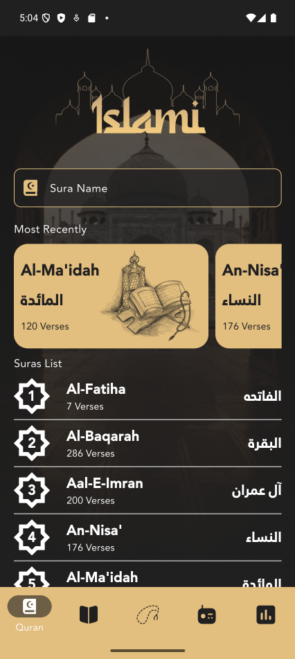
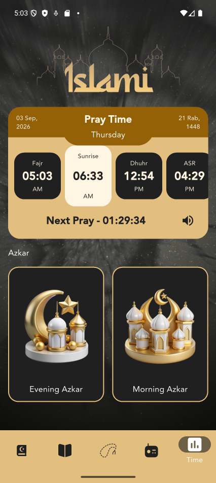
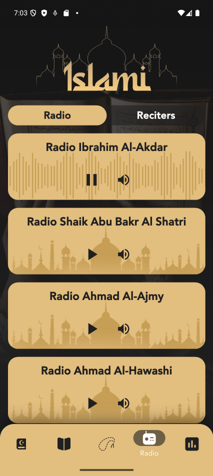
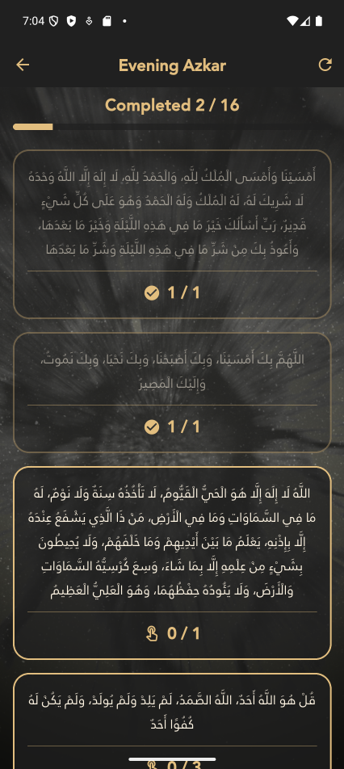
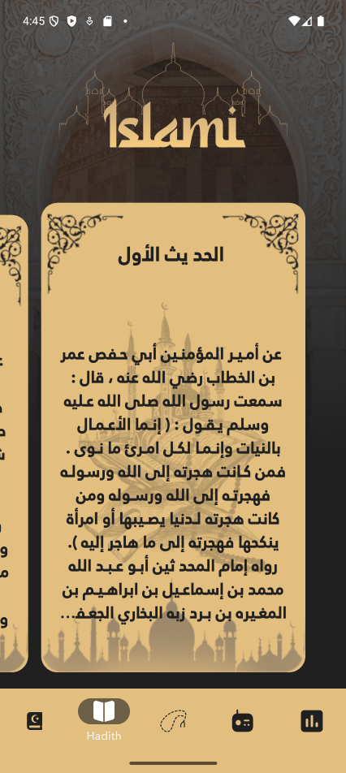
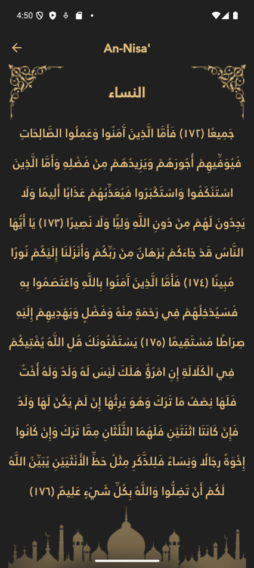
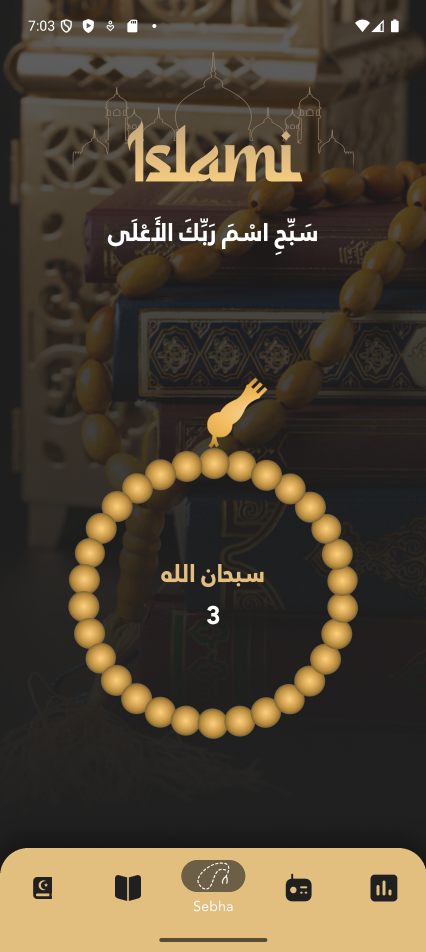
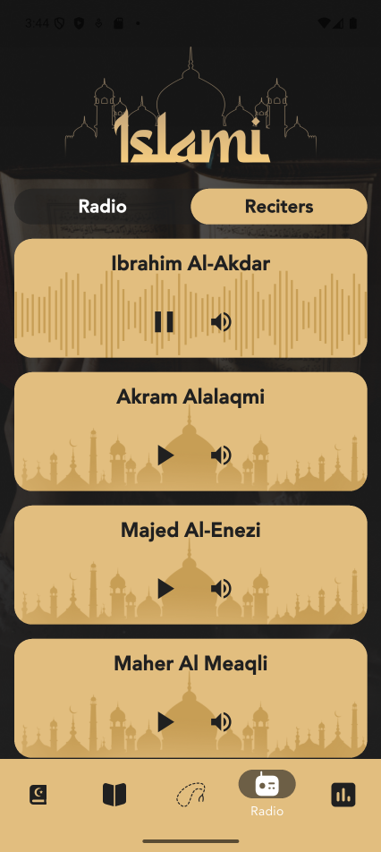

<div align="center">

# Islami

**A Flutter companion app for daily Islamic practice — read the Quran, browse the hadith, keep tasbeeh, listen to Quran radio and follow the prayer times.**

[](https://flutter.dev)
[](https://dart.dev)
[](#)
[](LICENSE)






</div>

---

## Features

| | |
|---|---|
| **Quran** | All 114 suras with the full Arabic text, search by Arabic or English name, and a "Most Recently" shelf of the last ten suras you opened |
| **Hadith** | Fifty hadith in a swipeable card deck, each opening to the full text |
| **Sebha** | A digital tasbeeh that turns bead by bead, cycles the four adhkar every 33 counts and remembers where you stopped |
| **Radio** | Live Quran radio stations and reciters streamed from mp3quran, with play and mute per station |
| **Prayer times** | Today's five prayers for wherever you are, the next one highlighted with a live countdown, plus the gregorian and hijri date |
| **Azkar** | The morning and evening supplications with a per-zekr counter, repeat targets and session progress |

<div align="center">






</div>

## Getting started

**Prerequisites** — Flutter `3.41` or newer (Dart `3.11+`) and an Android or iOS device or emulator.

```bash
git clone https://github.com/MostafaAkram-off/islami_app.git
cd islami_app
flutter pub get
flutter run
```

Prayer times use the device location. Granting it is optional — if location is off or the permission is denied, the app falls back to the city set in [`lib/core/api/api_manager.dart`](lib/core/api/api_manager.dart):

```dart
static const String fallbackCity = "cairo";
static const String fallbackCountry = "egypt";
```

## Tech stack

| | |
|---|---|
| **Framework** | Flutter, Material 3 |
| **State** | `StatefulWidget` + `setState` — no state-management package |
| **Networking** | [`dio`](https://pub.dev/packages/dio) |
| **Audio** | [`just_audio`](https://pub.dev/packages/just_audio) |
| **Storage** | [`shared_preferences`](https://pub.dev/packages/shared_preferences) |
| **Location** | [`geolocator`](https://pub.dev/packages/geolocator) |
| **Vector assets** | [`flutter_svg`](https://pub.dev/packages/flutter_svg) |
| **Splash** | [`flutter_native_splash`](https://pub.dev/packages/flutter_native_splash) |

The Quran text, the hadith and the azkar ship with the app as assets, so everything except the radio and the prayer times works offline.

## APIs

| Purpose | Endpoint |
|---|---|
| Prayer times | `GET https://api.aladhan.com/v1/timings/{dd-MM-yyyy}?latitude={lat}&longitude={lon}&method=5` |
| Prayer times (fallback) | `GET https://api.aladhan.com/v1/timingsByCity/{dd-MM-yyyy}?city={city}&country={country}` |
| Radio stations | `GET https://www.mp3quran.net/api/v3/radios?language=en` |
| Reciters | `GET https://www.mp3quran.net/api/v3/reciters?language=en` |

The `www.` on the mp3quran host is required — without it the server answers `301` and Dio does not follow the redirect by default.

## Tests

Unit tests cover the parsing and formatting logic that has no UI: the prayer-times response, the twelve-hour clock, the next-prayer rollover, the reciter track URLs, the Arabic-Indic numerals and the azkar lists.

```bash
flutter test
```

## Project structure

```
lib/
├── core/
│   ├── api/          ApiManager — every remote call
│   ├── local/        SharedPreferences wrapper, bundled-asset reader
│   ├── resources/    colors, strings, text styles, assets, routes, theme
│   └── utils/        small helpers
├── model/            SuraModel, HadethModel, PrayTimeModel, RadioModel,
│                     ReciterModel, AzkarModel, ZekrModel, OnboardingModel
└── ui/
    ├── onboarding/
    ├── home/
    │   ├── screen/   the bottom navigation shell
    │   └── tabs/     quran · hadeth · sebha · radio · time
    ├── sura_details/
    ├── hadeth_details/
    └── azkar/
```

Every screen folder keeps its own `widgets/`, so a widget lives next to the screen that uses it.

## Branching

Work happens on a branch per feature, opens as a pull request against `develop`, and `develop` merges into `master` once a set of features is done.

```
master ──────────────●──────────────
                    ╱
develop ──●──●──●──●───────────────
          ╱   ╱  ╱
     feature branches
```

## Credits

Design by **John Safwat** · Supervised by **Mohamed Nabil** · Built at **Route Academy**

Quran radio and reciters by [mp3quran.net](https://mp3quran.net) · Prayer times by [Aladhan](https://aladhan.com)

## License

The source code is released under the [MIT License](LICENSE).

The bundled assets are not: the design and artwork belong to **John Safwat**, the Janna typeface to its foundry, and the radio and prayer-time data to [mp3quran.net](https://mp3quran.net) and [Aladhan](https://aladhan.com). See the LICENSE file for the details.
